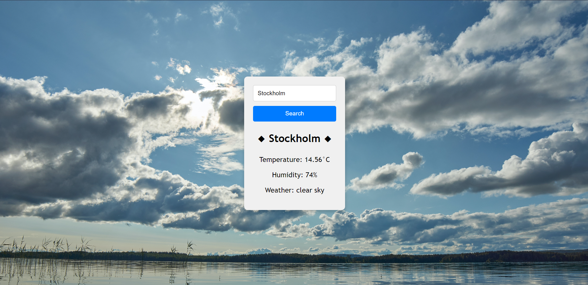
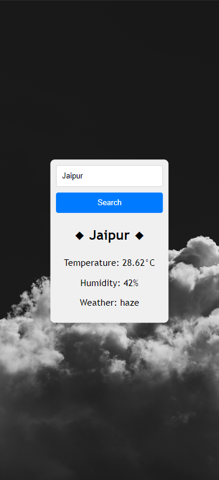

# Weather-z

# Simple but works ;)

# Steps:
  1. Git clone this repo
  2. Go to open weather to get your api-key
  3. Edit config.js file and enter your api-key there
  4. It will take few hours for your api key to activate so do some other work
  5. Now you can make it work.
